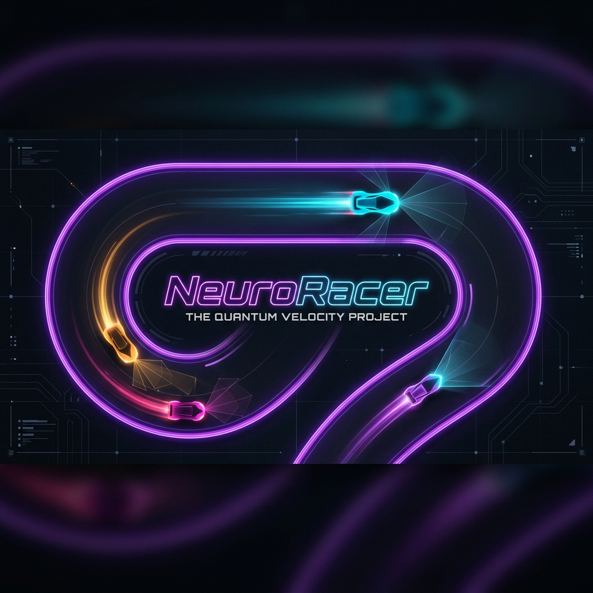
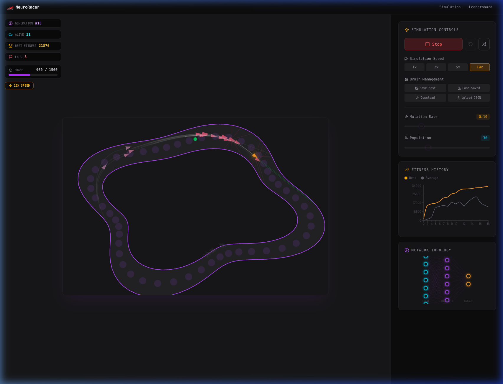
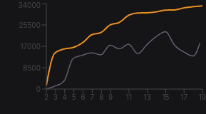

# 🏎️ NeuroRacer — Autonomous AI Racing



[](https://fastapi.tiangolo.com/)
[](https://nextjs.org/)
[](https://www.typescriptlang.org/)
[](https://www.docker.com/)

**NeuroRacer** is a high-performance neuroevolution simulation where autonomous agents learn to navigate complex procedural tracks using feed-forward neural networks and genetic algorithms.

---

## ✨ Key Features

- **🧠 Real-time Neuroevolution**: Watch as agents evolve through generations, refining their neural network weights to optimize racing lines.
- **⚡ Performance-First Engine**: A custom 2D physics and rendering engine built on HTML5 Canvas, running 100% client-side at 60fps.
- **🛤️ Procedural Track Generation**: Every simulation can generate a new unique circuit with varying difficulty and checkpoints.
- **📊 Full-Stack Dashboard**: Track fitness history and generation statistics with an elegant dashboard built with **shadcn/ui** and **Recharts**.
- **🔌 Persistence Tier**: Fast and lightweight API powered by **FastAPI** and **SQLite** to save the "best brains" for future analysis or competition.

---

## 📸 Showcase

### Real-time Simulation


### Advanced Dashboard


### Neural Network Visualization


---

## 🚀 Quick Start

The easiest way to run NeuroRacer is using **Docker Compose**.

1.  **Clone the repository**:
    ```bash
    git clone https://github.com/akc0r/NeuroRacer.git
    cd NeuroRacer
    ```

2.  **Spin up the containers**:
    ```bash
    docker-compose up -d
    ```

3.  **Explore**:
    - **Frontend**: [http://localhost:3000](http://localhost:3000)
    - **Backend API**: [http://localhost:8000/docs](http://localhost:8000/docs)

---

## 🧪 How it Works?

NeuroRacer combines several core concepts of artificial intelligence and game development:

### 1. The Brain (Neural Networks)
Each car uses a feed-forward neural network to process 5-7 proximity sensor inputs and output steering and acceleration values. 
[Read more in SIMULATION.md →](./docs/SIMULATION.md)

### 2. The Evolution (Genetic Algorithms)
Agents are evaluated based on their fitness. The "elite" individuals pass their genes (weights) to the next generation, with random mutations to explore better strategies.
[Read more in NEUROEVOLUTION.md →](./docs/SIMULATION.md)

### 3. The Backend (Analytics)
While the simulation runs in the browser, a FastAPI backend stores and serves historical results, enabling deep analytics on population progress.
[Read more in ARCHITECTURE.md →](./docs/ARCHITECTURE.md)

---

## 📂 Documentation

Deep dive into the technical details of the project:

- 🏛️ [**Architecture**](./docs/ARCHITECTURE.md) — System design and data flow.
- ⚙️ [**Backend**](./docs/BACKEND.md) — API endpoints and database models.
- 💻 [**Frontend**](./docs/FRONTEND.md) — UI components and simulation engine.
- 🧬 [**Simulation Logic**](./docs/SIMULATION.md) — NN & GA implementation details.
- 🏆 [**Leaderboard**](./assets/leaderboard.png) — Preview of the historical data view.

---

## 📜 License

Distributed under the MIT License. See `LICENSE` for more information.

---

<p align="center">
  Built with ❤️ by akc0r
</p>
