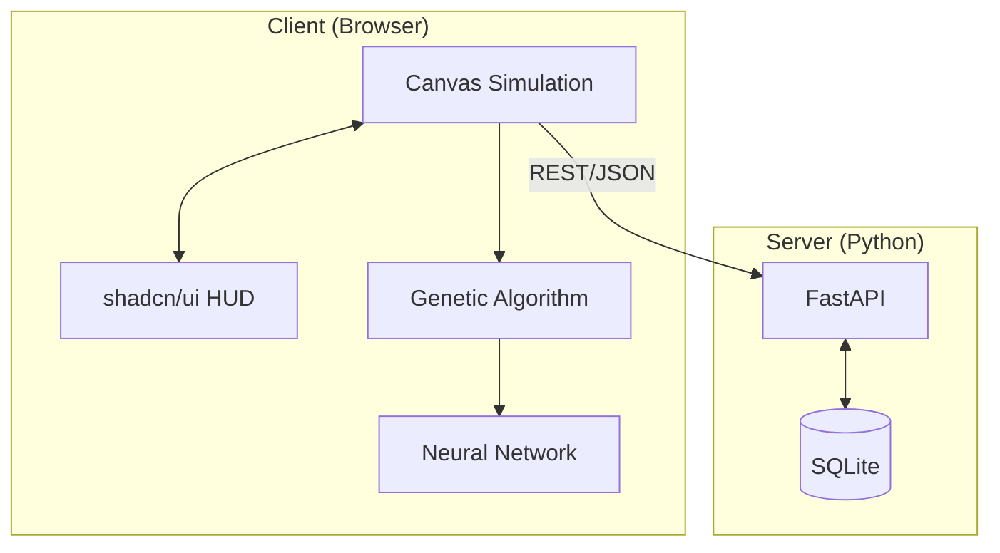

# Architecture Overview

NeuroRacer is built as a full-stack monorepo, separating concerns between a performance-focused simulation engine and a persistent meta-data layer.

## Monorepo Structure

```text
ai-racing/
├── apps/
│   ├── frontend/         # Next.js 14 App Router (Simulation & UI)
│   └── backend/          # FastAPI (Persistence & Analytics)
├── docker-compose.yml    # Container orchestration
└── README.md             # Project showcase
```

## System Data Flow

The simulation logic (Neural Networks, Genetic Algorithm, Physics) runs **100% client-side** in the browser. This ensures high performance (60fps) without taxing the server.

1.  **Simulation Loop**: The browser executes the game loop (`requestAnimationFrame`).
2.  **Genetic Step**: When a generation dies or times out, the best "brain" is identified.
3.  **Persistence**: The frontend sends the results (best fitness, weights, stats) to the FastAPI backend.
4.  **Retrieval**: On dashboard loads, the frontend fetches historical data to plot improvement charts.

### High-Level Diagram



## Communication Protocol
- **Transport**: HTTP/REST
- **Data Format**: JSON
- **Serialization**: Neural Network weights are serialized to JSON strings and stored as TEXT in SQLite.
